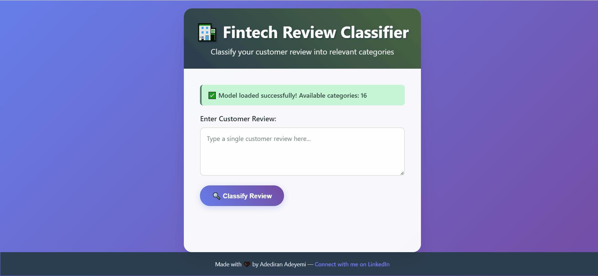
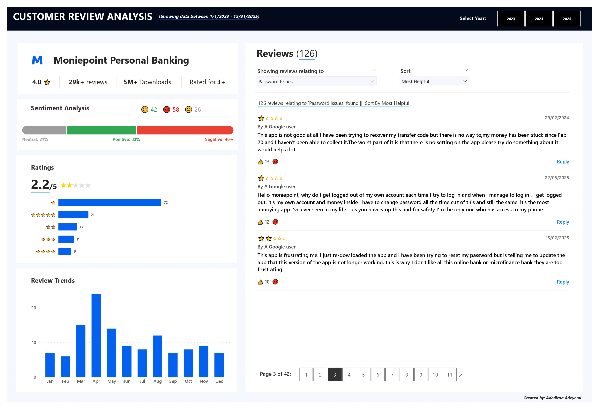

# Analysis of Moniepoint Banking App Reviews

## Live Demo
🚀 **Try the model now**: [Interactive Demo on Hugging Face Spaces](https://huggingface.co/spaces/adeyemi001/Multi-Labelled-Review-Categorization-Model)

## Flask Demo


## Power BI Dashboard
📊 **Interactive Analytics Dashboard**: [View Power BI Dashboard](https://app.powerbi.com/view?r=eyJrIjoiYjk1YWM3YmYtYWU5ZS00YjIxLWIwMmQtMWI0YjI2ZjQ2MWM3IiwidCI6IjQyOWYxMWVhLWM3NmQtNDczMS05M2M5LWM0MDZiNGYzMmE1YSJ9)



The dashboard provides comprehensive visual analytics including:
- Review volume trends over time
- Sentiment distribution analysis
- Category breakdown and frequency
- Customer service response metrics
- Key performance indicators (KPIs)
- Interactive filters for deep-dive analysis

## Table of Contents

1. [Executive Summary](#executive-summary)
2. [Review Categories](#review-categories)
3. [Project Overview](#project-overview)
4. [Technical Innovation: Model Development](#technical-innovation-model-development)
   - [Model Architecture](#model-architecture)
   - [Performance Metrics](#performance-metrics)
   - [Training & Validation](#training--validation)
5. [Model Deployment & Access](#model-deployment--access)
   - [Live Interactive Demo](#live-interactive-demo)
   - [Hugging Face Repository](#hugging-face-repository)
   - [Usage Instructions](#usage-instructions)
   - [API Integration](#api-integration)
6. [Business Intelligence Analysis](#business-intelligence-analysis)
   - [Customer Engagement Insights](#customer-engagement-insights)
   - [Critical Issues Identification](#critical-issues-identification)
   - [Competitive Advantages](#competitive-advantages)
7. [Strategic Recommendations for Moniepoint](#strategic-recommendations-for-moniepoint)
8. [Technical Implementation Details](#technical-implementation-details)
9. [Results & Insights](#results--insights)
10. [Future Work & Extensions](#future-work--extensions)
11. [Conclusion](#conclusion)

---

## Executive Summary

This personal project presents analysis of **Moniepoint's personal banking app** through advanced machine learning techniques applied to customer reviews scraped from Google Play Store. 

**Key Achievements:**
- **Developed Custom Model**: RoBERTa-based multi-label classifier achieving **93.7% F1-micro accuracy**
- **Analyzed 29,000+ Reviews**: Comprehensive dataset spanning multiple years of customer feedback
- **Deployed Production Model**: Publicly accessible via Hugging Face Hub and interactive web demo
- **Created Interactive Dashboard**: Power BI analytics dashboard for visual insights
- **Generated Business Insights**: Identified critical operational issues and competitive advantages
- **Created Actionable Intelligence**: Data-driven recommendations for product improvement

**Key Findings about Moniepoint:**
- Strong customer service performance with 81.83% review response rate
- Critical technical issues requiring immediate attention (417 combined mentions)
- Speed and reliability as core competitive advantages (857+ positive mentions)
- Consistent positive sentiment trend since August 2023

---

## Review Categories

The model classifies customer reviews into **16 distinct categories** that capture the full spectrum of user feedback and issues:

### Category List

1. **Account Registration** - Issues and feedback related to creating new accounts
2. **App Installation Issues** - Problems encountered during app download or installation
3. **App crashes or Slow** - Performance issues including crashes and slow response times
4. **App not Opening** - Critical failures where the app fails to launch
5. **Customer Inquiry** - General questions and information requests
6. **Customer Support** - Feedback about customer service interactions
7. **Failed Transaction** - Transaction failures and processing errors
8. **Feature Requests/Service Suggestion** - User suggestions for new features or improvements
9. **General Feedback** - Overall opinions and experiences with the app
10. **Login & Account Access** - Authentication and account access problems
11. **Network Failure** - Connectivity and network-related issues
12. **Other** - Miscellaneous feedback not fitting other categories
13. **Password Issues** - Password reset, recovery, and related problems
14. **Transaction Charges** - Concerns about fees and transaction costs
15. **UI/UX** - User interface and user experience feedback
16. **USSD Issues** - Problems with USSD code functionality

### Multi-Label Classification

The model uses **multi-label classification**, meaning a single review can be assigned to multiple categories simultaneously. For example, a review stating *"The app is slow and charges are too high"* would be classified under both **"App crashes or Slow"** and **"Transaction Charges"**.

This approach provides more nuanced insights into customer feedback, as many reviews contain multiple concerns or topics.

---

## Project Overview

### Motivation

Customer reviews rarely belong to a single category. Understanding what your customers want and identifying what your competitors are doing well is essential to business survival and competitive advantage. This analysis helps uncover value gaps that can be exploited to achieve market dominance. By applying multi-label classification to customer feedback, this project demonstrates how machine learning can extract actionable intelligence from unstructured data, enabling data-driven decision-making and strategic positioning in the fintech space.

### Data Collection & Scope
- **Target Application**: Moniepoint Personal Banking App (Google Play Store)
- **Data Source**: Web scraping of customer reviews and ratings
- **Dataset Size**: 29,000+ reviews spanning multiple years
- **Review Period**: Historical data through September 2025
- **Preprocessing**: Comprehensive data cleaning and label standardization using DeepSeek

### Methodology
- **Approach**: End-to-end machine learning pipeline from data collection to deployment
- **Model Selection**: Transformer-based architecture for superior language understanding
- **Validation Strategy**: Temporal data splitting to prevent data leakage
- **Deployment**: Public model hosting for accessibility and reproducibility
- **Visualization**: Interactive Power BI dashboard for stakeholder insights

---

## Technical Innovation: Model Development

### Model Architecture

**Base Model**: RoBERTa-base (roberta-base)
- **Architecture Type**: Transformer-based encoder
- **Task Configuration**: Multi-label sequence classification
- **Maximum Sequence Length**: 256 tokens
- **Output Layer**: Sigmoid activation for multi-label predictions
- **Loss Function**: Binary Cross Entropy with Logits Loss

### Performance Metrics

The model achieved exceptional performance on the held-out test set:

| Metric | Score | 
|--------|-------|
| **F1 Micro** | **93.73%** | 
| **F1 Macro** | 62.74% | 
| **Precision Micro** | 95.36% | 
| **Recall Micro** | 92.15% | 
| **ROC AUC Micro** | 99.69% | 

### Training & Validation

**Training Configuration:**
- **Optimizer**: AdamW with learning rate 2e-5
- **Batch Sizes**: 8 (training), 16 (evaluation)
- **Training Epochs**: 6 with early stopping (patience=2)
- **Hardware**: CUDA-enabled GPU training
- **Regularization**: Weight decay of 0.01

**Training Progress:**
| Epoch | Training Loss | Validation Loss | F1 Micro | F1 Macro | Best Model |
|-------|---------------|-----------------|----------|----------|------------|
| 1 | 0.0519 | 0.0300 | 0.9128 | 0.5355 | - |
| **2** | **0.0361** | **0.0259** | **0.9373** | **0.6274** | **✓** |
| 3 | 0.0263 | 0.0262 | 0.9370 | 0.6341 | - |
| 4 | 0.0178 | 0.0293 | 0.9344 | 0.6144 | - |

*Best model selected from Epoch 2 based on F1-micro score*

---

## Model Deployment & Access

### Live Interactive Demo

**Try it now**: [https://huggingface.co/spaces/adeyemi001/Multi-Labelled-Review-Categorization-Model](https://huggingface.co/spaces/adeyemi001/Multi-Labelled-Review-Categorization-Model)


### Hugging Face Repository

**Model Repository**: [adeyemi001/Multi-Labelled-Review-Categorization-Model](https://huggingface.co/adeyemi001/Multi-Labelled-Review-Categorization-Model)

**Model Files Structure:**
```
model/
├── config.json              # Model configuration
├── model.safetensors        # Model weights
├── tokenizer.json           # Tokenizer vocabulary
├── tokenizer_config.json    # Tokenizer configuration
├── vocab.json               # Vocabulary mappings
├── merges.txt              # BPE merges
├── special_tokens_map.json  # Special tokens
├── mlb.joblib              # Multi-label binarizer
├── labels.json             # Label names
└── metadata.json           # Training metadata
```

### Usage Instructions

#### Quick Start Implementation
```python
import os
import json
import joblib
import torch
import numpy as np
from transformers import AutoTokenizer, AutoModelForSequenceClassification
from huggingface_hub import hf_hub_download

# Model configuration
REPO_ID = "adeyemi001/Multi-Labelled-Review-Categorization-Model"
DEVICE = "cuda" if torch.cuda.is_available() else "cpu"

# Download model files
model_files = [
    "model/config.json",
    "model/tokenizer.json", 
    "model/tokenizer_config.json",
    "model/vocab.json",
    "model/merges.txt",
    "model/special_tokens_map.json",
    "model/model.safetensors"
]

downloaded_files = {}
for file in model_files:
    path = hf_hub_download(repo_id=REPO_ID, filename=file)
    downloaded_files[file] = path

# Setup local model directory
model_dir = "./temp_model"
os.makedirs(model_dir, exist_ok=True)

import shutil
for file, path in downloaded_files.items():
    local_path = os.path.join(model_dir, os.path.basename(file))
    shutil.copy2(path, local_path)

# Load model components
tokenizer = AutoTokenizer.from_pretrained(model_dir)
model = AutoModelForSequenceClassification.from_pretrained(model_dir).to(DEVICE)
model.eval()

# Load preprocessing components
mlb_path = hf_hub_download(repo_id=REPO_ID, filename="model/mlb.joblib")
labels_path = hf_hub_download(repo_id=REPO_ID, filename="model/labels.json")

mlb = joblib.load(mlb_path)
with open(labels_path, "r", encoding="utf-8") as f:
    labels = json.load(f)
```

#### Prediction Function
```python
def sigmoid(x):
    return 1 / (1 + np.exp(-x))

def predict_review_categories(texts, threshold=0.5):
    """
    Predict categories for customer reviews
    
    Args:
        texts: Single review string or list of reviews
        threshold: Classification threshold (0.0-1.0)
    
    Returns:
        predictions: List of predicted categories for each review
        probabilities: Probability scores for all categories
    """
    if isinstance(texts, str):
        texts = [texts]

    # Tokenize input
    encodings = tokenizer(
        texts,
        truncation=True,
        padding=True,
        max_length=256,
        return_tensors="pt"
    ).to(DEVICE)

    # Generate predictions
    with torch.no_grad():
        outputs = model(**encodings)
        logits = outputs.logits.cpu().numpy()

    # Convert to probabilities and binary predictions
    probs = sigmoid(logits)
    pred_bin = (probs >= threshold).astype(int)

    # Decode predictions
    all_preds = []
    for row in pred_bin:
        row_2d = np.array([row])
        categories = mlb.inverse_transform(row_2d)[0]
        all_preds.append(categories)

    return all_preds, probs

# Example usage
sample_reviews = [
    "The app crashes every time I try to open it.",
    "Please add a dark mode and reduce transaction charges.",
    "Fast transfers and great customer service!"
]

predictions, probabilities = predict_review_categories(sample_reviews, threshold=0.5)

for review, pred, prob in zip(sample_reviews, predictions, probabilities):
    print(f"\nReview: {review}")
    print(f"Predicted categories: {pred}")
    print(f"Top probabilities: {dict(zip(labels, prob.round(3)))}")
```

### API Integration

#### Batch Processing
```python
# Process multiple reviews efficiently
def batch_analyze_reviews(review_list, batch_size=16, threshold=0.5):
    """
    Process large numbers of reviews in batches
    """
    results = []
    
    for i in range(0, len(review_list), batch_size):
        batch = review_list[i:i+batch_size]
        predictions, probabilities = predict_review_categories(batch, threshold)
        
        for j, (review, pred, prob) in enumerate(zip(batch, predictions, probabilities)):
            results.append({
                'review': review,
                'categories': pred,
                'probabilities': dict(zip(labels, prob)),
                'index': i + j
            })
    
    return results

# Custom threshold adjustment
def analyze_with_confidence_levels(reviews):
    """
    Analyze reviews with different confidence thresholds
    """
    results = {}
    thresholds = [0.3, 0.5, 0.7]
    
    for threshold in thresholds:
        predictions, _ = predict_review_categories(reviews, threshold)
        results[f'threshold_{threshold}'] = predictions
    
    return results
```

---

## Business Intelligence Analysis

### Customer Engagement Insights

**Moniepoint's Customer Service Performance:**
- **Response Rate**: 81.83% (significantly above industry standards of ~60%)
- **Average Response Time**: 29.3 hours
- **Response Distribution**: 75% of responses delivered within 25 hours
- **Response Quality**: Consistent engagement with customer concerns

**Sentiment Analysis Results:**
- **Overall Trend**: Positive sentiment trajectory maintained since August 2023
- **Recent Performance**: Strong upward momentum in Q2-Q3 2025
- **Current Sentiment Score**: 0.46+ average (above neutral baseline)
- **Rating Correlation**: Clear positive correlation between star ratings and sentiment scores

### Critical Issues Identification

**Model-Identified Priority Issues (Ranked by Frequency & Sentiment Impact):**

#### Tier 1: Critical System Failures
1. **App Not Opening** - 217 mentions
   - *Impact*: Complete user access failure
   - *Sentiment*: Highly negative (-0.8 average)
   - *Business Risk*: Immediate churn potential

2. **Login Issues** - 101 mentions  
   - *Impact*: Authentication barriers
   - *Sentiment*: Consistently negative
   - *Business Risk*: User abandonment

3. **Failed Transactions** - 99 mentions
   - *Impact*: Core functionality failure
   - *Sentiment*: Extremely negative (-0.9 average)
   - *Business Risk*: Trust erosion

#### Tier 2: Financial Concerns  
4. **Transaction Charges** - 117 mentions
   - *Impact*: Pricing competitiveness
   - *Sentiment*: Negative (-0.6 average)
   - *Business Risk*: Competitive disadvantage

5. **High Charges** - 106 mentions
   - *Impact*: Value perception
   - *Sentiment*: Moderate negative
   - *Business Risk*: Price sensitivity

#### Tier 3: Performance Issues
6. **Slow App Performance** - 96 mentions
7. **Account Access Issues** - 76 mentions  
8. **Account Restrictions** - 74 mentions
9. **App Performance Issues** - 66 mentions
10. **Frequent Updates** - 57 mentions

**Combined Risk Assessment**: 417 total mentions across critical technical categories represent significant customer experience challenges.

### Competitive Advantages

**Identified Strengths (High Positive Sentiment):**

#### Core Differentiators
1. **Fast Transactions** - 297 mentions
   - *Sentiment*: +0.7 average
   - *Strategic Value*: Primary competitive advantage

2. **Fast Transfers** - 282 mentions
   - *Sentiment*: +0.8 average  
   - *Strategic Value*: Market differentiation

3. **Speed** - 278 mentions
   - *Sentiment*: +0.6 average
   - *Strategic Value*: Brand positioning opportunity

#### User Experience Strengths
4. **Ease of Use** - 187 mentions
   - *Sentiment*: +0.5 average
   - *Strategic Value*: UX competitive advantage

5. **Reliability** - 183 mentions
   - *Sentiment*: +0.6 average
   - *Strategic Value*: Trust building

**Total Speed-Related Positive Mentions**: 857 (Strong market positioning asset)

---

## Strategic Recommendations for Moniepoint

### Establish Real-Time Customer Intelligence Infrastructure

**Automated Review Monitoring System:**
- Implement continuous ingestion pipeline for Play Store and App Store reviews
- Deploy the trained model in production for real-time categorization and sentiment scoring
- Set up automated alerting for critical issues (app crashes, failed transactions, login failures) when mention volume exceeds baseline thresholds
- Create executive dashboards with live KPIs tracking issue velocity, resolution time, and sentiment trends by category

**Multi-Channel Feedback Integration:**
- Consolidate review data with in-app feedback, customer support tickets, and social media mentions into a unified data warehouse
- Build correlation analysis between review categories and support ticket volumes to identify systemic vs isolated issues
- Implement cross-platform sentiment tracking to detect early warning signals across channels

### Build Predictive Customer Experience Analytics

**Issue Prediction & Prevention System:**
- Deploy time-series forecasting models to predict issue volume spikes based on historical patterns, app release cycles, and seasonal trends
- Create pre-release testing protocols that prioritize features most frequently mentioned in negative reviews (authentication, transaction processing, app stability)
- Establish A/B testing framework with review sentiment as a key success metric for new features and UI changes

**Churn Risk Scoring:**
- Develop customer-level risk scores combining review sentiment, issue categories, and interaction patterns
- Implement proactive outreach campaigns for high-risk segments identified through negative review patterns
- Track correlation between specific issue categories and subsequent app uninstalls or account dormancy

### Operationalize Competitive Intelligence

**Competitive Benchmarking System:**
- Deploy the same model to analyze competitor reviews (OPay, PalmPay, Kuda) for continuous competitive intelligence
- Create monthly competitive reports comparing issue prevalence, feature gaps, and sentiment trends
- Build "Voice of Customer" comparison matrix highlighting where Moniepoint outperforms and underperforms competition

**Strategic Product Planning:**
- Integrate review analytics into quarterly product roadmap planning with data-driven prioritization based on issue frequency, sentiment impact, and competitive gaps
- Establish feature request tracking system that quantifies demand from review mentions and correlates with usage data
- Create feedback loops between engineering, product, and customer success teams with shared access to review analytics

### Implement Dynamic Pricing Intelligence

**Fee Perception Monitoring:**
- Build real-time tracking of transaction charge mentions and sentiment to gauge pricing elasticity
- Implement competitive fee analysis by monitoring competitor reviews for pricing feedback
- Create pricing experiment framework using review sentiment as leading indicator before revenue impact

**Value Communication Strategy:**
- Develop in-app education campaigns addressing the 223 fee-related complaints with clear value proposition messaging
- Test pricing transparency features (fee calculators, comparison tools) and measure impact on subsequent review sentiment
- Create customer segmentation based on price sensitivity indicators from reviews to enable targeted retention offers

### Deploy Engineering Performance Management

**Technical Debt Prioritization:**
- Establish engineering sprint planning informed by review-derived issue rankings weighted by frequency, sentiment impact, and business risk
- Implement release quality gates that require review sentiment stability before major version deployments
- Create post-deployment monitoring that tracks review category changes within 48-72 hours of releases

**Reliability Engineering Metrics:**
- Set SLA targets based on critical issue categories: app opening (217 mentions), login (101 mentions), and transaction failures (99 mentions)
- Implement automated regression testing focused on most-mentioned failure scenarios
- Build infrastructure monitoring that correlates system metrics with review complaint patterns

### Create Closed-Loop Customer Communication

**Issue Response Automation:**
- Develop automated response templates categorized by issue type with personalized resolution timelines
- Implement status update system that proactively notifies affected users when issues are being addressed
- Create transparency portal showing known issues, estimated fix timelines, and resolution confirmation

**Leverage Positive Feedback:**
- Build marketing asset library from the 857 speed-related positive mentions with customer testimonials
- Create case studies highlighting successful customer experiences from 5-star reviews
- Implement referral program triggers for customers who leave positive reviews about speed and reliability

### Establish Organizational Voice-of-Customer Culture

**Cross-Functional Review Analytics Access:**
- Provide role-specific dashboards for engineering (technical issues), product (feature requests), customer success (support patterns), and marketing (competitive positioning)
- Conduct monthly "Voice of Customer" sessions where teams review top trending issues and success stories
- Include review-derived metrics in executive KPIs and performance reviews

**Continuous Model Improvement:**
- Implement active learning pipeline where customer success agents validate model predictions to continuously improve accuracy
- Expand category taxonomy as new issue patterns emerge
- Build specialized sub-models for high-priority categories (authentication, transactions) requiring more nuanced classification

---

## Technical Implementation Details

### Model Architecture Deep Dive

**RoBERTa Base Configuration:**
```python
# Model specifications
{
    "model_type": "roberta",
    "vocab_size": 50265,
    "max_position_embeddings": 514,
    "num_attention_heads": 12,
    "num_hidden_layers": 12,
    "hidden_size": 768,
    "intermediate_size": 3072,
    "num_labels": len(unique_categories),
    "problem_type": "multi_label_classification"
}
```

**Training Hyperparameters:**
```python
{
    "learning_rate": 2e-5,
    "train_batch_size": 8,
    "eval_batch_size": 16,
    "num_train_epochs": 6,
    "warmup_steps": 500,
    "weight_decay": 0.01,
    "logging_steps": 100,
    "eval_steps": 500,
    "save_steps": 1000,
    "early_stopping_patience": 2
}
```

### Data Processing Pipeline

**Review Preprocessing Steps:**
1. **Text Cleaning**: Removal of special characters, normalization
2. **Language Detection**: Filter for English reviews
3. **Duplicate Removal**: Eliminate redundant entries
4. **Label Standardization**: Consistent category naming via DeepSeek
5. **Quality Filtering**: Remove low-quality or spam reviews

**Temporal Data Splitting:**
- **Training Set**: Reviews before September 1, 2025
- **Validation Set**: Random 20% of training data
- **Test Set**: Reviews from September 1, 2025 onwards
- **Rationale**: Prevents data leakage and tests real-world performance

### Model Validation Strategy

**Cross-Validation Approach:**
- **Temporal Validation**: Future data performance testing
- **Category Balance**: Stratified sampling for rare categories
- **Performance Metrics**: Multiple evaluation criteria
- **Threshold Optimization**: ROC analysis for optimal decision boundaries

### Power BI Dashboard Implementation

**Dashboard Features:**
- **Interactive Visualizations**: Dynamic filtering and drill-down capabilities
- **Time Series Analysis**: Trend identification across multiple time periods
- **Category Distribution**: Visual breakdown of review categories
- **Sentiment Tracking**: Real-time sentiment monitoring
- **KPI Monitoring**: Key performance indicators at a glance
- **Custom Filtering**: Filter by date range, category, sentiment, and rating

**Data Integration:**
- Direct connection to processed review dataset
- Real-time data refresh capabilities
- Automated data transformation and cleansing
- Calculated measures for advanced analytics

---

## Results & Insights

### Model Performance Analysis

**Strengths:**
- **High Precision**: 95.36% micro precision indicates reliable predictions
- **Strong Recall**: 92.15% micro recall ensures comprehensive issue detection
- **Excellent Discrimination**: 99.69% ROC AUC shows superior category separation
- **Production Ready**: Low latency inference suitable for real-time applications

**Category-Specific Performance:**
- **Best Performance**: Technical issues and user experience categories
- **Moderate Performance**: Complex multi-faceted feedback
- **Areas for Improvement**: Rare categories with limited training data

### Business Intelligence Insights

**Key Discoveries:**
1. **Customer Service Excellence**: Moniepoint's 81.83% response rate demonstrates strong customer engagement
2. **Technical Debt**: Critical system issues require immediate engineering focus
3. **Competitive Positioning**: Speed advantage provides strong market differentiation
4. **Customer Loyalty**: Despite technical issues, positive sentiment trends indicate brand strength

**Actionable Intelligence:**
- **Priority Matrix**: Clear ranking of issues by frequency and sentiment impact
- **Resource Allocation**: Data-driven recommendations for engineering priorities  
- **Market Positioning**: Specific strengths to leverage in competitive landscape
- **Risk Assessment**: Quantified customer churn risks from technical issues

### Comparative Analysis

**Industry Context:**
- **Response Rate**: Moniepoint's 81.83% vs industry average ~60%
- **Model Accuracy**: 93.7% F1-score exceeds typical industry benchmarks (85-90%)
- **Analysis Depth**: Multi-label approach provides richer insights than traditional sentiment analysis

---

## Future Work & Extensions

### Model Enhancement Opportunities

**Technical Improvements:**
1. **Multilingual Support**: Expand to support local Nigerian languages
2. **Real-time Learning**: Implement continuous model updates
3. **Ensemble Methods**: Combine multiple models for improved accuracy
4. **Specialized Models**: Develop domain-specific classification variants

**Feature Engineering:**
1. **Temporal Features**: Incorporate review timing patterns
2. **User Behavior**: Include reviewer history and patterns
3. **App Version Correlation**: Link feedback to specific app releases
4. **Competitor Comparison**: Multi-app comparative analysis

### Business Applications

**Expanded Use Cases:**
1. **Predictive Analytics**: Forecast customer satisfaction trends
2. **Product Roadmap**: Data-driven feature prioritization
3. **Competitive Intelligence**: Automated competitor review analysis
4. **Customer Segmentation**: Data-driven user persona development

**Integration Opportunities:**
1. **Customer Support**: Automated ticket routing and prioritization
2. **Product Development**: Real-time feature feedback analysis
3. **Marketing Intelligence**: Campaign effectiveness measurement
4. **Quality Assurance**: Automated release impact assessment

### Dashboard Enhancements

**Planned Dashboard Features:**
1. **Predictive Analytics**: Forecast future sentiment trends
2. **Comparative Benchmarking**: Industry comparison views
3. **Alert System**: Automated notifications for critical issues
4. **Custom Report Generation**: Automated executive summaries
5. **Mobile Dashboard**: Responsive design for mobile access

---

## Conclusion

This project demonstrates the practical application of NLP techniques to real-world business intelligence challenges. The project provides actionable insights for Moniepoint's customer experience optimization.

### Project Significance

This project showcases the intersection of advanced machine learning techniques and practical business applications. The ability to extract meaningful insights from unstructured customer feedback, combined with interactive visual analytics, provides a comprehensive solution for customer experience management.

**For Moniepoint**: The analysis provides a comprehensive roadmap for addressing customer concerns while leveraging existing competitive advantages. The Power BI dashboard enables stakeholders to monitor key metrics and track improvement initiatives in real-time.

**For the ML Community**: The model serves as a benchmark for multi-label classification in the fintech domain and is freely available for research and commercial applications.

**For Future Applications**: The methodology and tools developed can be adapted for similar customer feedback analysis across various industries and platforms.

---

## Project Links

- 🚀 **Live Demo**: [Interactive Spaces Demo](https://huggingface.co/spaces/adeyemi001/Multi-Labelled-Review-Categorization-Model)
- 🤗 **Model Repository**: [Hugging Face Model Hub](https://huggingface.co/adeyemi001/Multi-Labelled-Review-Categorization-Model)
- 📊 **Power BI Dashboard**: [Interactive Analytics Dashboard](https://app.powerbi.com/view?r=eyJrIjoiYjk1YWM3YmYtYWU5ZS00YjIxLWIwMmQtMWI0YjI2ZjQ2MWM3IiwidCI6IjQyOWYxMWVhLWM3NmQtNDczMS05M2M5LWM0MDZiNGYzMmE1YSJ9)
- 💼 **LinkedIn**: [Adediran Adeyemi](https://www.linkedin.com/in/adediran-adeyemi-17103b114/)

**Project Author**: Adediran Adeyemi  
**Completion Date**: September 2025  
**Flask Demo**: Available in project repository
